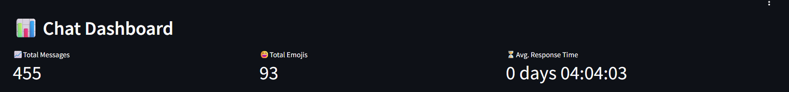
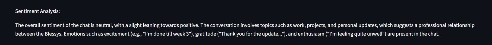

# 📊 Chat Analysis – WhatsApp Chat Insight Tool

**Chat Analysis** is an intelligent tool that deeply analyzes the content of a WhatsApp conversation and presents meaningful insights through an interactive dashboard.

It’s designed for anyone who wants to explore messaging patterns, track engagement, and uncover the emotional tone of conversations.

---

## 🔍 Key Features

- 🧵 **Conversation Initiators**  
  Identify who usually starts the conversations and how the dynamic changes over time.

- ⏰ **Peak Activity Times**  
  Discover when the chat is most active throughout the day or week.

- 😊 **Emoji Usage Tracker**  
  Visualize which emojis are used most often and by whom.

- 💬 **Sentiment Analysis**  
  Understand the tone of the messages—positive, negative, or neutral.

- 📈 **Engagement Insights**  
  Measure who is the most active, how fast they respond, and how consistent they are in the chat.

- 🤖 **Smart Chat Queries**  
  Ask natural language questions like *“When did the fight happen?”* to get accurate, data-backed answers.

---

## 📸 Screenshots

### 📍 Dashboard Overview


### ⏱ Peak Activity Heatmap


### 😄 Emoji Usage Visualization


### 📊 Sentiment Over Time


---

## 🚀 Getting Started

1. Export your WhatsApp chat as a `.txt` file.
2. Upload the chat file to the tool.
3. Let the analysis run and view the dashboard.

> 💡 Make sure to clean any sensitive data before uploading!

---

## 🛠 Built With

- Python (Pandas, Matplotlib, Seaborn, NLTK, TextBlob)
- Streamlit (for the dashboard)
- Regex & NLP tools for parsing and analysis

---

## 📚 Use Cases

- Understand communication styles in personal or group chats.
- Perform sentiment analysis for research or relationship studies.
- Visual storytelling of message patterns.

---

## 📦 Folder Structure

```bash
chat_analysis/
├── analysis.py
├── app.py
├── utils/
│   ├── parser.py
│   ├── sentiment.py
├── assets/
│   ├── logo.png
│   ├── styles.css
├── screenshots/
│   ├── dashboard.png
│   ├── peak_activity.png
│   ├── emoji_usage.png
│   └── sentiment.png
└── README.md
