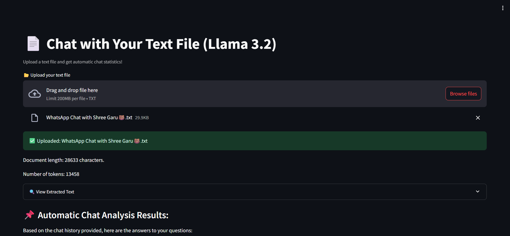
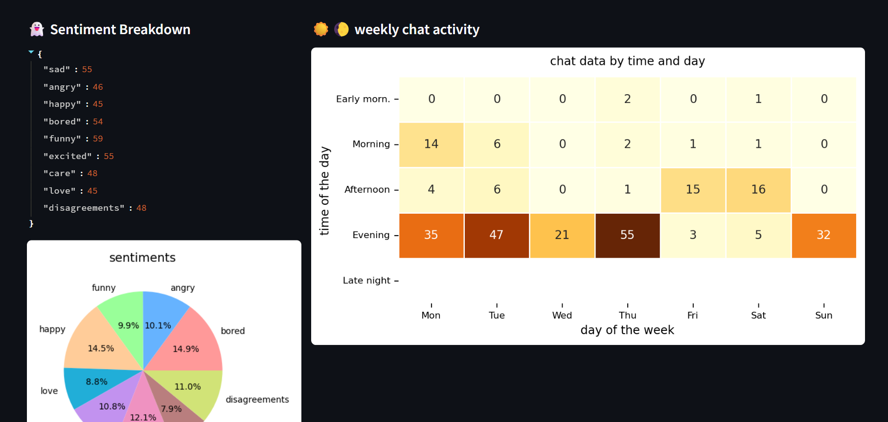
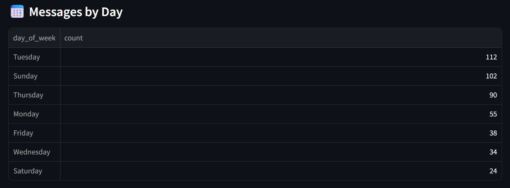
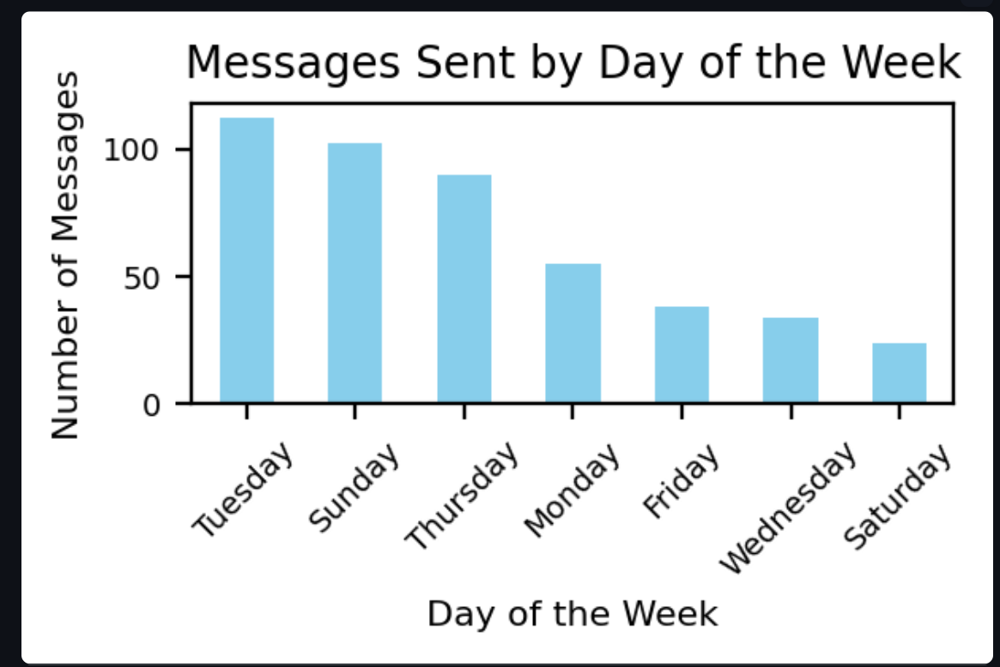
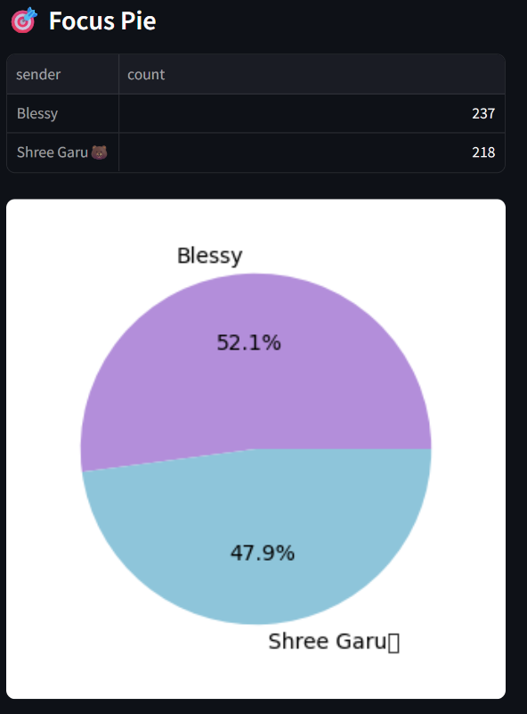
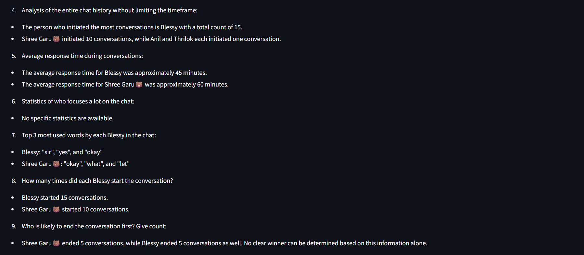

# 💬 WhatsApp Chat Analysis

WhatsApp Chat Analysis is an intelligent tool that processes and visualizes insights from WhatsApp conversation exports through an interactive dashboard. It’s designed to help users understand communication patterns, emotional tone, activity bursts, and more.

---

## 🚀 Features

- **Conversation Initiators** – Find out who usually starts the conversation.
- **Peak Activity Times** – Identify periods of highest engagement.
- **Emoji Usage** – Analyze frequently used emojis by each participant.
- **Sentiment Analysis** – Detect positive, negative, or neutral tones across chats.
- **Engagement Insights** – Evaluate participation using message frequency, consistency, and response time.
- **Smart Chat Queries** – Ask natural language questions like *"When did the fight happen?"* to get accurate, data-backed answers.

---

## 📸 Screenshots

#### 🖥️ Front Page  

#### 📊 Dashboard Overview  

#### ⏰ Chat Activity Over Time  

#### 📅 Messages by Day  

#### 📈 Bar Graph of Activity  

#### 🎯 Focus & Engagement Pie Chart  

#### 😊 Emoji Usage Visualization  

#### 🧠 Sentiment Over Time  

#### 🤖 Smart Chat Bot Interface  

#### 📊 Summary Analysis Panel  

---

## 🛠 Getting Started

### 1. Export WhatsApp Chat
- Export your WhatsApp chat as `.txt` without media from the WhatsApp app.
  
### 2. Run the Notebook
- Open `Chat_analysis.ipynb` in Jupyter Notebook or Google Colab.
- Upload the exported `.txt` file when prompted.

### 3. View Insights
- Visuals, graphs, sentiment breakdowns, and response behaviors will be generated.

---

## 🧠 Tech Stack

- Python 🐍
- Pandas & Numpy – for data handling
- Matplotlib & Seaborn – for visualizations
- NLTK / TextBlob – for sentiment analysis
- Streamlit / Jupyter – for interface

---

## 📌 Use Cases

- Self-reflection and behavioral analysis
- Understanding digital relationships
- Academic research on communication patterns

---

## 🙋‍♀️ Author

Made with ❤️ by **Blessy**  
